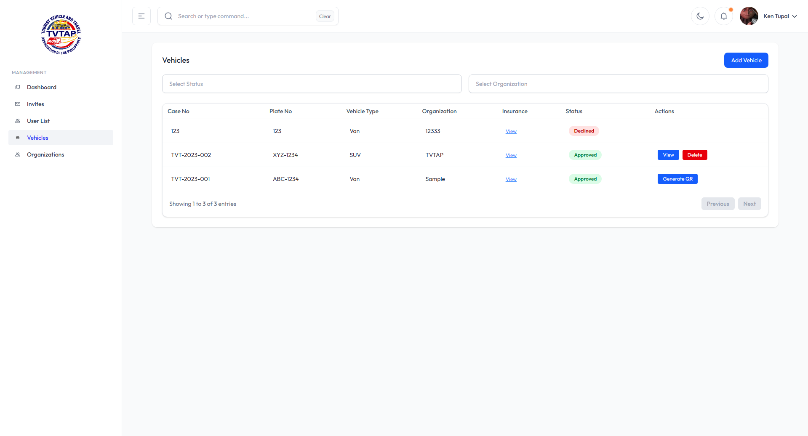

# TVTAP: Tourist Vehicle and Travel Association of the Philippines

TVTAP is a comprehensive web-based management platform designed for the Tourist Vehicle and Travel Association of the Philippines. It streamlines the administration of tourist vehicles, organizations, user profiles, and QR-based vehicle verification, providing a modern, secure, and user-friendly dashboard for both administrators and members.

## Features

- **Dashboard Overview**: Visual analytics for registered and active vehicles, monthly statistics, and QR scan data.
- **User Management**: Invite users, assign roles (President, Member, Driver, etc.), and manage user profiles across organizations.
- **Vehicle Management**: Register, approve, and track vehicles, including insurance documentation and QR code generation for each vehicle.
- **Organization Management**: Add, edit, and view travel organizations, with detailed descriptions and creation logs.
- **QR Code System**: Generate and scan official vehicle QR codes for quick verification and access to vehicle details.
- **Authentication**: Secure sign-in and role-based access control for different user types.
- **Modern UI/UX**: Clean, responsive interface with dark mode support, built using React and Tailwind CSS.

## Technology Stack

- **Frontend**: React, TypeScript, Tailwind CSS, Vite
- **Backend**: Node.js, Express (see `/server` directory)
- **Database & Auth**: Supabase
- **Charts & Visualization**: ApexCharts, FullCalendar
- **Other Libraries**: React Router, Axios, QRCode.react, Headless UI, and more

## Screenshots

| Dashboard                               | Invites                             | Organizations                                   | Vehicles                              | QR Details                | Sign In                            | User List                              |
| --------------------------------------- | ----------------------------------- | ----------------------------------------------- | ------------------------------------- | ------------------------- | ---------------------------------- | -------------------------------------- |
|  |  |  |  |  |  |  |

## Folder Structure

- `/client` - Frontend React app
- `/server` - Backend API (Node.js/Express)
- `/screenshots` - UI screenshots for documentation

## Contact & Support

For questions, support, or contributions, please open an issue or contact the maintainer via GitHub.
